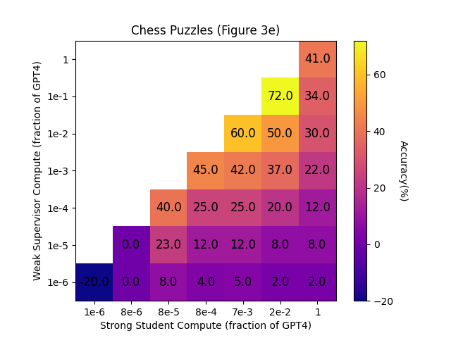

These are updated graphs proposed for the OpenAI Weak-to-Strong Generalization Paper along with the scripts I used to generate them. 

I found the original graphs difficult to intuitively grasp, and felt they could be improved, especially considering the weak and strong compute fractions both seemed to be interval'ed in similar fashions, and were both scaled logarithmically, yet they were separated rather than being used as the x and y-axes. So I did my best to estimate the values in the original graph and made some updated ones.

### Original Graph:

###Colored Table Proposal:

###Scatterplot Proposal:

